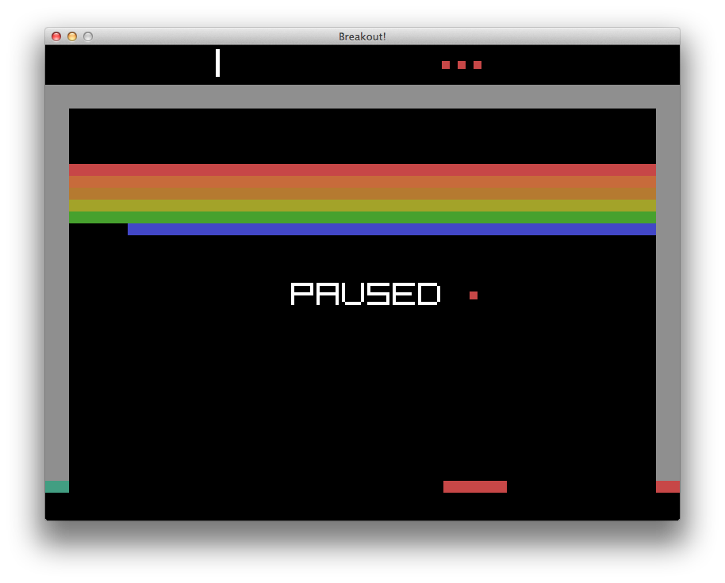

# Breakout.clj

A clojure breakout game using a [component-entity system][ces] and [LWJGL][lw].

## Usage

`lein run`

## License

Copyright © 2013 David Beckingsale

Distributed under the Eclipse Public License, the same as Clojure.

[lw]: http://www.lwjgl.org/
[ces]: http://www.chris-granger.com/2012/12/11/anatomy-of-a-knockout/
